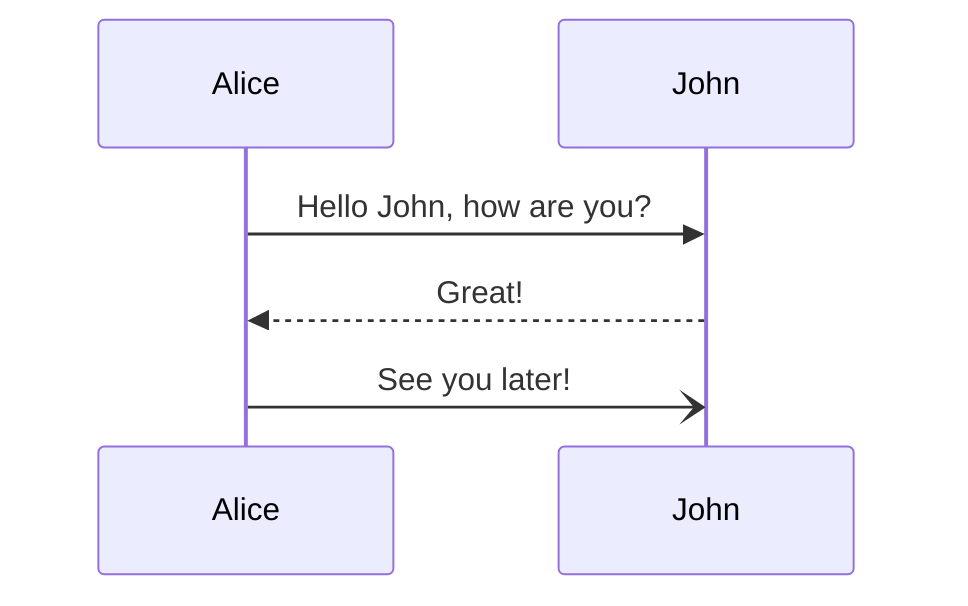

Welcome to the pages-test!

```math
x = \frac{-b \pm \sqrt{b^2 - 4ac}}{2a}
```


```mermaid
sequenceDiagram
    Alice->>John: Hello John, how are you?
    John-->>Alice: Great!
    Alice-)John: See you later!
```
